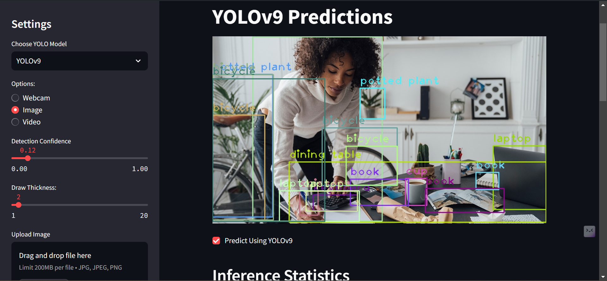

# yoloEYE

## Description

This project utilizes YOLO (You Only Look Once) models for object detection tasks. It provides a user-friendly interface built with Streamlit, allowing users to easily upload images or video streams to see object detections in real-time. The application supports various YOLO models, including YOLOv8, YOLOv9, and YOLOv10; offering flexibility and accuracy in detecting objects across different scenarios.

## Screenshots  

Here are some screenshots of the app showcasing its key features and design:  

  

## Getting Started

These instructions will get you a copy of the project up and running on your local machine for development and testing purposes.

### Prerequisites

What things you need to install the software and how to install them.

```bash
pip install -r requirements.txt
```

### Installing

A step by step series of examples that tell you how to get a development environment running

Say what the code already does and you don’t need to do a thing like this.

```bash
cd your_project_directory
pip install -r requirements.txt
```

And repeat

```bash
streamlit run app.py
```

End with an example of getting some data regarding the system. It may be a good idea to describe the table structure.

## Running the Tests

Explain how to run the automated tests for this system

```bash
pytest
```

Break down into end to end.

## Deployment

Add additional notes about how to deploy this on a live system

## Built With

* [Python](https://www.python.org/) - Programming Language
* [Streamlit](https://streamlit.io/) - Framework for Building Machine Learning and Data Science Web Apps
* [Ultralytics](https://github.com/ultralytics/yolov5) - Implementation of YOLO Models

## Contributing

1. Fork the Project
2. Create your Feature Branch (`git checkout -b feature/fooBar`)
3. Commit your Changes (`git commit -m 'Add some fooBar'`)
4. Push to the Branch (`git push origin feature/fooBar`)
5. Open a Pull Request
